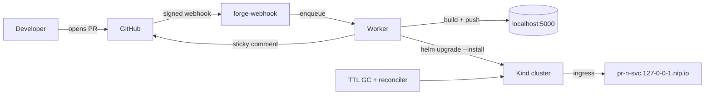

# ForgeOps

ForgeOps spins up a disposable, fully-deployed preview environment for every pull
request on a local Kind cluster - no cloud account and no cost. Open a PR and get
a working URL; close it and everything is cleaned up.

## Quickstart

```bash
# 1. Bring up the cluster, ingress, and local registry.
make up

# 2. Export the controller configuration.
export FORGE_GITHUB_TOKEN=ghp_xxx        # needs the "repo" scope
export FORGE_GITHUB_OWNER=your-user
export FORGE_WEBHOOK_SECRET=devsecret
export FORGE_GITHUB_REPO=demo-svc        # optional: enables startup reconcile

# 3. Run the webhook controller and expose it to GitHub.
go run ./cmd/forge-webhook

# In another shell, start a free tunnel and point a GitHub webhook at it:
# cloudflared tunnel --url http://localhost:8080

# 4. Scaffold and push a new service, then open a PR.
go run ./cmd/forge new --name demo-svc --push
```

When you tear down, run `make down` to delete the whole cluster.

**For detailed end-to-end testing and Webhook configuration, see the [Testing Guide](TESTING.md).**

## Architecture



Two binaries:
- `forge` - the CLI that scaffolds a service and (optionally) creates and pushes a GitHub repo.
- `forge-webhook` - the controller that provisions, reconciles, and garbage-collects preview environments.

## How the networking works

- **nip.io wildcard DNS.** Hosts like `pr-7-demo-svc.127-0-0-1.nip.io` resolve to
  `127.0.0.1` with zero DNS setup - nip.io echoes the embedded IP back. The Kind
  cluster maps host ports 80/443 to the ingress controller, so the URL just works
  in your browser.
- **Local registry.** `deploy/kind/registry.sh` runs `registry:2` as
  `kind-registry` and the cluster config adds a containerd mirror so nodes pull
  `localhost:5000/<svc>:pr-<n>` by the same name you push to. No image ever leaves
  your machine.

## Environment variables

| Variable | Required | Purpose |
| --- | --- | --- |
| `FORGE_GITHUB_TOKEN` | Yes | GitHub PAT with the `repo` scope; used to create/push repos and post PR comments. |
| `FORGE_GITHUB_OWNER` | Yes | GitHub user or org that owns the repos. |
| `FORGE_WEBHOOK_SECRET` | Yes (webhook) | HMAC secret shared with the GitHub webhook; verified per request. |
| `FORGE_GITHUB_REPO` | No | Repo the controller reconciles on startup; empty disables reconcile. |
| `KUBECONFIG` | No | Overrides the default `~/.kube/config` lookup. |

## Operations

- Metrics: `http://localhost:8080/metrics` (Prometheus text). Stack: `docker compose -f deploy/observability/docker-compose.yaml up -d`.
- RBAC for in-cluster runs: `kubectl apply -f deploy/rbac/controller.yaml`.
- Previews expire after 24h via the TTL garbage collector; closing a PR removes them immediately.

## License

MIT. See `LICENSE`.